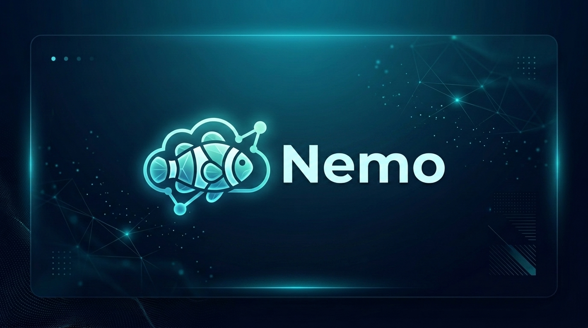

# Nemo



<div align="center">

[](https://reactjs.org/)
[](https://vitejs.dev/)
[](https://supabase.com/)
[](./LICENSE)

**A high-performance, feature-rich cloud file management system built with React, Vite, and Supabase.**  
*Featuring a hybrid storage fallback, interactive analytics, and 30-day trash lifecycle management.*

[Features](#key-features) • [Tech Stack](#tech-stack) • [Getting Started](#getting-started) • [Supabase Setup](#supabase-setup) • [License](#license)

</div>

---

## Key Features

### Interactive Storage Dashboard
- Real-time storage capacity gauge showing used space versus total storage limit.
- Category distribution breakdown across Documents, Images, Audio, Video, and Archives.
- Quick action shortcuts for instant file uploads and capacity management.

### Advanced File Management & Search
- Multi-category filtering and real-time instant search by title, extension, or tags.
- Favorite files toggle for instant access to starred items.
- Dual layout modes: Grid View with visual thumbnails and List View for compact data density.

### Built-in File Previewer
- In-app preview modal supporting image rendering, video playback, audio stream player, and document text view.
- Metadata panel showing file size, MIME type, upload timestamp, tags, and direct storage URLs.

### Smart Trash Bin & Auto-Purge
- Soft-delete capability with a 30-Day Auto-Purge Lifecycle.
- Live countdown badge showing days remaining until permanent deletion.
- One-click file restoration back to the active drive or immediate permanent deletion.

### Hybrid Storage Architecture
- Operates out-of-the-box using Browser Local Storage & Indexed DB mock storage.
- Connects seamlessly to Supabase Storage Buckets & PostgreSQL when environment credentials are configured.

---

## Tech Stack

| Layer | Technology | Description |
| :--- | :--- | :--- |
| **Frontend Framework** | `React 18.3` | Modular component architecture with Hooks & Context |
| **Build Tool** | `Vite 5.4` | Fast HMR and optimized production bundles |
| **Icons & UI** | `Lucide React` | Clean, modern vector icon set |
| **Database & Storage** | `Supabase JS` | Cloud Object Storage buckets + PostgreSQL RLS policies |
| **Styling** | `Vanilla CSS3` | Custom design tokens, CSS variables, animations |

---

## Project Structure

```
nemo/
├── public/
│   └── nemo_storage_banner.jpg    # Application banner graphic
├── src/
│   ├── components/                # Modular React UI Components
│   │   ├── Dashboard.jsx          # Storage overview & analytics charts
│   │   ├── FileCard.jsx           # Grid & list item renderer
│   │   ├── FileList.jsx           # Main file view & category filters
│   │   ├── FileViewerModal.jsx    # Media preview & details modal
│   │   ├── LoginGate.jsx          # Security authentication gate
│   │   ├── Navbar.jsx             # Top bar search & user status
│   │   ├── SettingsModal.jsx      # Storage limits & credentials
│   │   ├── Sidebar.jsx            # Category & view navigation
│   │   ├── SqlGuideModal.jsx      # Supabase SQL setup instructions
│   │   ├── TrashBin.jsx           # Recycle bin & countdown timers
│   │   └── UploadModal.jsx        # Multi-file dropzone & tagging
│   ├── services/
│   │   ├── storageService.js      # Storage manager (Local + Supabase)
│   │   └── supabaseClient.js      # Supabase client initializer
│   ├── utils/                     # Formatting & file helpers
│   ├── App.jsx                    # Root application component
│   ├── index.css                  # Design system tokens & utility styles
│   └── main.jsx                   # Application entry point
├── .env                           # Environment configuration
├── .gitignore                     # Git exclusion rules
├── LICENSE                        # Open source MIT License
├── package.json                   # Dependencies & scripts
└── vite.config.js                 # Vite configuration
```

---

## Getting Started

### Prerequisites
- Node.js (v16.0 or higher)
- npm or yarn / pnpm

### Installation & Execution

1. **Clone the repository**:
   ```bash
   git clone https://github.com/your-username/nemo.git
   cd nemo
   ```

2. **Install dependencies**:
   ```bash
   npm install
   ```

3. **Start the development server**:
   ```bash
   npm run dev
   ```

4. **Open in browser**:
   Navigate to `http://localhost:5173` to access the application.

---

## Supabase Setup (Optional)

To enable cloud storage persistence, configure your Supabase instance:

1. Create a `.env` file in the root directory:
   ```env
   VITE_SUPABASE_URL=https://your-project.supabase.co
   VITE_SUPABASE_ANON_KEY=your-anon-key-here
   ```

2. Execute the following SQL snippet in your Supabase SQL Editor to create the storage bucket:

```sql
-- Create public storage bucket for Nemo Storage
INSERT INTO storage.buckets (id, name, public) 
VALUES ('nemo-files', 'nemo-files', true)
ON CONFLICT (id) DO NOTHING;

-- Set up permissive security policies for file access
CREATE POLICY "Public Read Access" 
ON storage.objects FOR SELECT 
USING (bucket_id = 'nemo-files');

CREATE POLICY "Public Insert Access" 
ON storage.objects FOR INSERT 
WITH CHECK (bucket_id = 'nemo-files');

CREATE POLICY "Public Delete Access" 
ON storage.objects FOR DELETE 
USING (bucket_id = 'nemo-files');
```

---

## License

This project is open-source software licensed under the [MIT License](./LICENSE). Feel free to use, modify, and distribute it.
